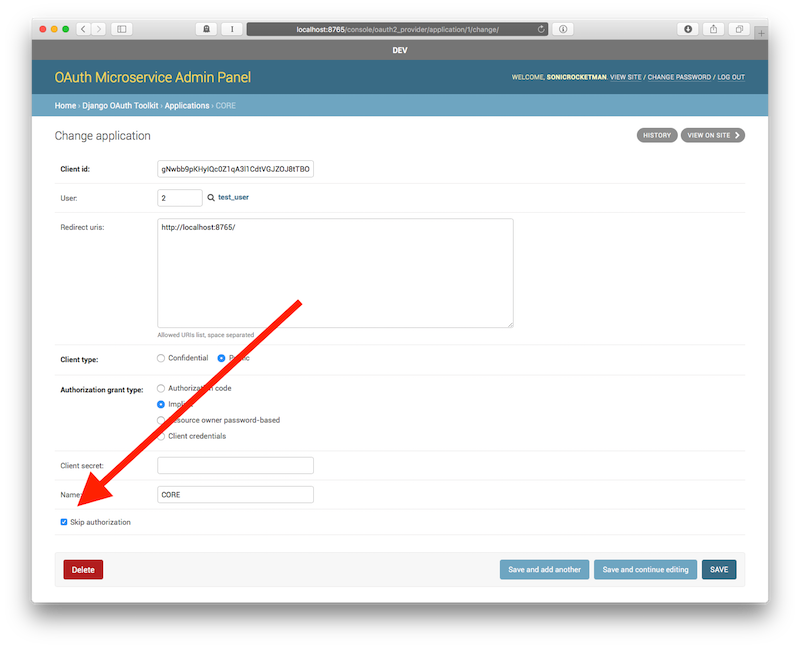

# OAuth Microservice

*A User Management Backend, OAuth Provider, and Django REST API for external application permissions.*

## Overview

This standalone OAuth Microservice provides your application with user managment, OAuth Provider, and permissions REST APIs. It also supports user creation by a privedged user(s). The project runs entirely in Docker, and comes with a rich test suite.

## Installation

OAuth Microservice uses Docker and Docker compose so ensure that you have both installed on your host machine.


```bash
> git clone <repo_url> && cd oauth_microservice
> docker-machine create -d virtualbox oauth-microservice
> eval $(docker-machine env oauth-microservice)
> docker-compose up -d
> docker-compose run api python3 manage.py migrate
> docker-compose run api ./manage.py rebuild_permissions
> docker-compose run api ./manage.py createsuperuser
... (follow prompt) ...

# Use this command to avoid setting up implicit client apps manually.
> docker-compose run api ./manage.py create_public_application <Client Owner Username>
> docker-compose run api ./manage.py create_sample_users
```


## Running the Project

Running the project in development is as easy as:

```bash
$ docker-compose up
```

The project is served on port 80.

Making changes to the application permissions requires a database change. To do so, run the following commands:
```bash
> docker-compose run api ./manage.py rebuild_permissions
... (follow prompt) ...
```


Now the API is fully up and running but we need to do 1 last thing before it's actually useful. You can cURL the API root though to see if it's working, or visit the following URL in your browser.

**Note:** If you log in with Django's Admin panel using the super user you created above, then you should be able to browse the API in your browser.


```bash
$ http /

HTTP/1.0 401 Unauthorized
//...

{
    "detail": "Authentication credentials were not provided."
}
```

If you see the above message, you're up and running. Continue to the next step to gain API access to the API.


## Setting Up an OAuth Client

> Skip this step if you've used the above create_public_application command to create your application.

All of your REST API calls must be by an Application on behalf of a User. To set up an Application's OAuth credentials, go to [http(s)://YOUR_DOCKER_MACHINE_IP/console] in your browser and login using your super user account from above. Click on "New Application". Fill out the form with your desired credentials.

For most internal cases you'll need the following:

- Name: Your Client App's Name
- Client Type: Public
- Grant Type: Implicit (or Authorization Code for 3rd party API access)
- Redirect URI: url://to/your/client/app/

**Note:** For all Public Client Types, a Client Secret is not used and should be deleted for clarity.

**Note:** For internal APIs using Implicit Grants, if you want to Skip the  Authorization step, see the **Skipping Authorization** step.


### Skipping Authorization

If your API is deployed internally or the API is only for use by your 1st-party client, you may want to skip the step of asking the user to grant explicit permission after logging in (as the client is trusted).

To do this, go to the Django Admin Panel *after creating your OAuth Application*, and find your App under Django OAuth Toolkit > Applications. Select it and check the "Skip Authorization" checkbox, and save the app.



--------


# User Guide

In the following sections we'll explore how to use the API as both an OAuth Provider and external permissions system.


## Logging In

Once you've created your OAuth Application you can request access on behalf of the user. To do this create a URL with the following pattern:

### For Implicit Grants

```
http://localhost/o/token/authorize?client_id=<client_id>&response_type=token
```

For more information see: [Django-OAuth-Toolkit's Documentation](https://django-oauth-toolkit.readthedocs.io)


## Creating Custom Permissions

Permissions are loaded in at build-time from the `api/permissions.yaml`. Simply add a permission in the form below and rebuild the app to see your changes.

```yaml
some_permission_key_name: A really nice permission description.
```

## Granting Permissions

Permissions can be granted to a user via the Django Admin Panel. Navigate to `/console/` in your browser and login with the super user credentials you created earlier. If you select a given user, then you can add/remove permissions to/from that user.


## Querying Permissions

As an OAuth client you can access the permissions for an authenticated user.

```bash
http /permissions.json "Authorization: Bearer <token>

{
    "count": 2,
    "next": null,
    "previous": null,
    "results": [
        {
            "codename": "global_read",
            "name": "Read access to any object.",
            "url": "http://localhost:8000/permissions/global_read/"
        },
        {
            "codename": "global_write",
            "name": "Write access to any object.",
            "url": "http://localhost:8000/permissions/global_write/"
        }
    ]
}
```


## Running the Tests and Coverage

Running the tests and getting the code coverage is done with the following command.

```bash
$ docker-compose run api ./docker_tests_entrypoint.sh
```

You can browse the coverage HTML files locally in the `api/coverage` directory or by going to `http://localhost/sys/api-coverage/` in your browser after running the project.
